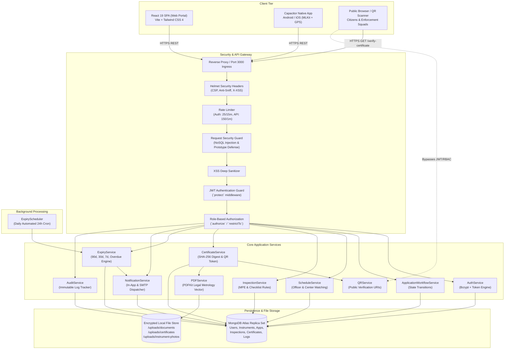
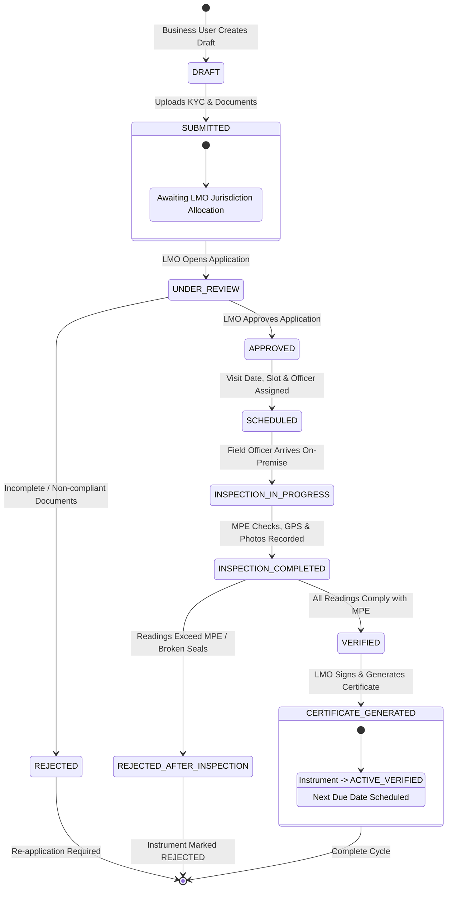
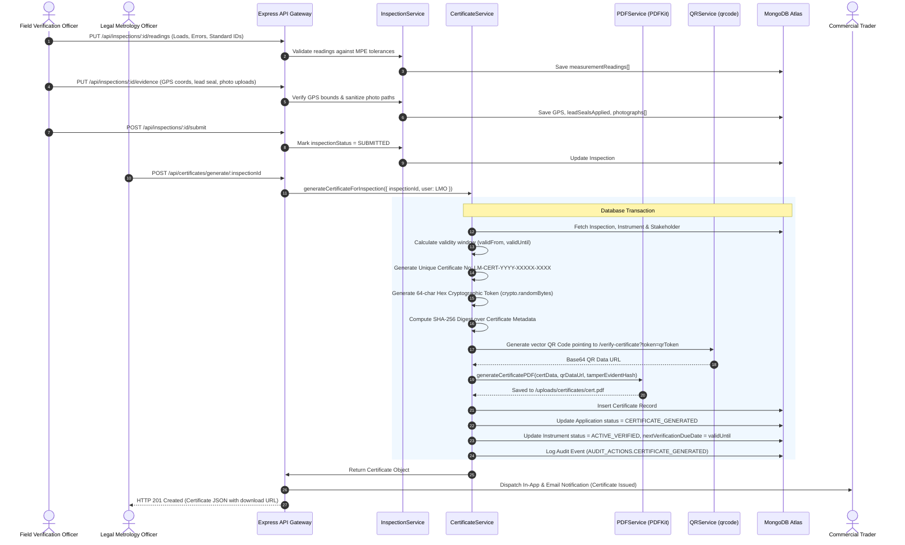
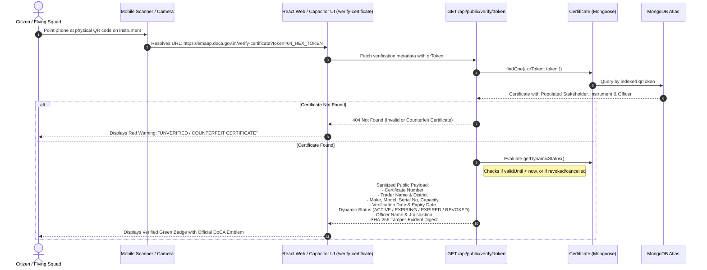

# e-Maap Verify: System Architecture Documentation
**Smart India Hackathon (SIH) — Problem Statement ID: 26036**  
**Department of Consumer Affairs (DoCA), Government of India**  
**Architecture Specification & Component Interaction Diagrams**

---

## 1. High-Level System Architecture

The following diagram illustrates the multi-tier enterprise architecture of **e-Maap Verify**, showing client applications, the security gateway, backend application services, and persistent data storage.



---

## 2. Verification Application Lifecycle State Machine

This state diagram depicts the formal lifecycle of a `VerificationApplication` and the corresponding status transitions of the associated `Instrument`.



---

## 3. Inspection, Calibration & Certificate Issuance Sequence

The sequence diagram below details the interaction between the Field Officer, Legal Metrology Officer (LMO), Backend Services, PDF Engine, and MongoDB when executing an on-site calibration verification.



---

## 4. Public QR Verification & Cryptographic Anti-Counterfeiting Flow

The following diagram shows how any consumer or enforcement squad verifies an instrument on-site without needing an account or login.



---

## 5. Expiry Engine & Statutory Due-Date Escalation Architecture

The automated expiry engine executes continuously in the background to ensure all weights and measures are calibrated on schedule.

```mermaid
flowchart TD
    Start([24-Hour Cron Tick / Manual Admin Trigger]) --> ScanCertificates[Scan Certificates Table<br/>Filter: non-revoked, non-cancelled]
    Start --> ScanInstruments[Scan Instruments Table<br/>Filter: isActive = true, status != REJECTED]

    subgraph Certificate Alert Pipeline
        ScanCertificates --> ComputeCertDays[Compute daysRemaining = validUntil - now]
        ComputeCertDays --> IsCertExpired{daysRemaining <= 0?}
        IsCertExpired -- Yes --> SendCertExpired[Dispatch CERTIFICATE_EXPIRED<br/>Priority: URGENT<br/>Recipient: Business User]
        IsCertExpired -- No --> MatchCertWindow{Matched Window?}
        MatchCertWindow -- "days <= 7" --> SendCert7[Dispatch CERTIFICATE_EXPIRING_7]
        MatchCertWindow -- "days <= 30" --> SendCert30[Dispatch CERTIFICATE_EXPIRING_30]
        MatchCertWindow -- "days <= 60" --> SendCert60[Dispatch CERTIFICATE_EXPIRING_60]
        MatchCertWindow -- "> 60 days" --> CertUpToDate[Status: ACTIVE (No alert needed)]
    end

    subgraph Instrument Expiry & Multi-Tier Escalation Pipeline
        ScanInstruments --> ComputeInstDiff[Compute diffDays = nextVerificationDueDate - now]
        ComputeInstDiff --> CheckInstStage{Due Stage?}

        CheckInstStage -- "diffDays <= 0 (Overdue)" --> MutateStatus[Mutate Instrument.status = EXPIRED<br/>Log Audit Event: INSTRUMENT_EXPIRED]
        MutateStatus --> DispatchExpired[Dispatch VERIFICATION_EXPIRED (CRITICAL)<br/>Recipients: Business User + District LMO + Admin]

        CheckInstStage -- "0 < diffDays <= 7" --> DispatchUrgent[Dispatch VERIFICATION_URGENT (HIGH)<br/>Recipients: Business User + District LMO]

        CheckInstStage -- "7 < diffDays <= 30" --> DispatchWarning[Dispatch VERIFICATION_WARNING (MEDIUM)<br/>Recipient: Business User]

        CheckInstStage -- "30 < diffDays <= 90" --> DispatchReminder[Dispatch VERIFICATION_REMINDER (LOW)<br/>Recipient: Business User]

        CheckInstStage -- "> 90 days" --> InstUpToDate[Status: UP_TO_DATE]
    end

    subgraph Dedup & Storage
        SendCertExpired & SendCert7 & SendCert30 & SendCert60 & DispatchExpired & DispatchUrgent & DispatchWarning & DispatchReminder --> CheckDuplicate{Alert already sent<br/>for this cycle?}
        CheckDuplicate -- Yes --> SkipAlert[Skip Creation (Deduplication)]
        CheckDuplicate -- No --> CreateNotif[Insert into Notification Collection<br/>Send SMTP Email if enabled]
    end

    SkipAlert --> End([Cycle Complete])
    CreateNotif --> End
```

---

## 6. Tenancy & Role-Based Data Isolation Model

To ensure multi-tenant security across businesses, enforcement districts, and administrative tiers, data access is strictly segmented at both the database query and file-serving layers.

```mermaid
graph LR
    subgraph Data Access Boundaries
        subgraph Business User Boundary
            BU[Business User] -->|Can only query| OwnRecords["- Own Stakeholder Profile<br/>- Own Instruments<br/>- Own Applications<br/>- Own Certificates<br/>- Own Notifications"]
        end

        subgraph District LMO Boundary
            LMO[Legal Metrology Officer] -->|Can only query| DistrictRecords["- District Applications<br/>- District Verification Schedules<br/>- District Inspections<br/>- Can Issue Certificates for District"]
        end

        subgraph Field Officer Boundary
            FO[Field Verification Officer] -->|Can only query| AssignedOnly["- Explicitly Assigned Schedules<br/>- Explicitly Assigned Inspection Checklists<br/>- Assigned Evidence Files"]
        end

        subgraph Central Admin Boundary
            Admin[Administrator / Super Admin] -->|Full Jurisdiction| GlobalRecords["- All Applications & Instruments<br/>- Officer Re-assignment<br/>- Revocation Authority<br/>- System-wide Audit Logs & Diagnostics"]
        end
    end
```



### Storage-Level Tenant Isolation (`/uploads`)
When any user requests a protected file (e.g. `/api/files/certificates/cert.pdf` or `/api/files/instrument-photos/photo.jpg`):
1. The request passes through `getSecureFile` in `fileController.js`.
2. The user's JWT identity is verified.
3. If `req.user.role === 'BUSINESS_USER'`:
   - A compound `$or` query confirms that the file URL is referenced in a record belonging to the user's `Stakeholder` document.
   - If the file is not linked to their own instruments, applications, or certificates, access is aborted with **HTTP 403 Forbidden**.
4. If `req.user.role === 'FIELD_VERIFICATION_OFFICER'`:
   - The system queries `VerificationInspection` to ensure the officer is recorded as `assignedOfficer` or `officer` for that specific evidence.
5. If `req.user.role === 'LEGAL_METROLOGY_OFFICER'`:
   - Enforces jurisdictional and assignment checks for inspection evidence photos.
